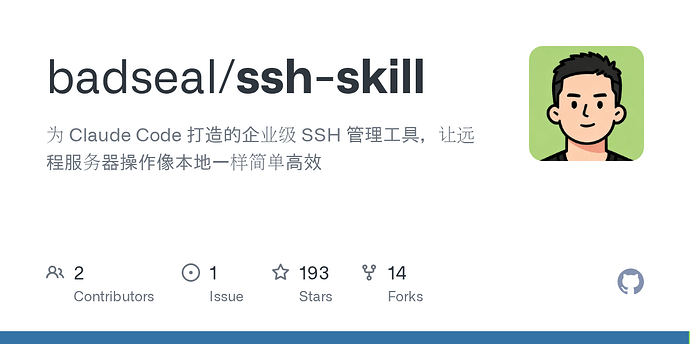
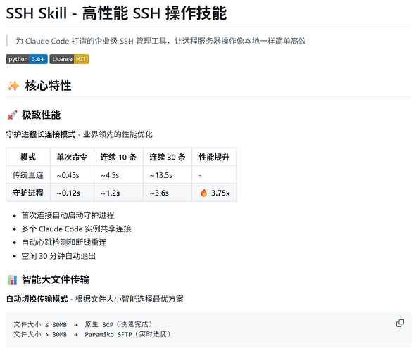

# SSH Skill - 高性能 SSH 操作技能

- 作者：badseal
- 发布时间：2026-03-16T03:53:11.724Z
- 原帖链接：[https://linux.do/t/topic/1763330](https://linux.do/t/topic/1763330)
- 高保真页面：[查看 HTML 快照](./index.html)

---

#### 本帖使用社区公益推广，符合推广要求。我申明并遵循社区要求的以下内容：

-   **我的项目是免费使用的，无收费（变相收费、赞助）部分：** 是
-   **我的帖子已经打上 [公益推广](/tag/1515-tag/1515) 标签：** 是
-   **我的项目属于个人项目，与公司或商业机构无关：** 是
-   **我的项目不存在QQ、TG等群组引流：** 是
-   **我的项目不存在非运营必要的网站引流：** 是
-   **我的项目不存在为他人推广、AFF：** 是
-   **我的项目无关联的商业项目：** 是
-   **我的 GitHub 项目无未开源部分：** 是
-   **我的站点存在登录，并已接入 LINUX DO Connect：** 否
-   **我帖子内的项目介绍，AI生成、润色内容部分已截图发出：** 是
-   **以上选择我承诺是永久有效的，接受社区和佬友监督：** 是

_以下为项目介绍正文内容，AI生成、润色内容已使用截图方式发出_

* * *

我平时工作中，会使用claude code连接多个服务器进行工作，让AI直接使用openssh比较麻烦，而且很多细节上，AI处理不太好，会多次尝试，虽然也能达到目的，但是耽误了时间。这个skill就是为了解决这个问题开发的。

**主要特点**：

-   高性能（调用原生openssh功能）
-   长连接守护进程
-   超大文件传输
-   服务器间直连
-   统一配置管理（使用openssh原生配置格式，在终端可直接使用，例如ssh server1）
-   对密码连接的服务器，采用Paramiko实现长连接

我开发的这个skill已经在实际工作中用了半年了，功能基本完善，分享给大家。

欢迎各位佬star

[github.com](https://github.com/badseal/ssh-skill)

### [GitHub - badseal/ssh-skill: 为 Claude Code 打造的企业级 SSH 管理工具，让远程服务器操作像本地一样简单高效](https://github.com/badseal/ssh-skill)

为 Claude Code 打造的企业级 SSH 管理工具，让远程服务器操作像本地一样简单高效

[

image1074×908 71.3 KB

](https://cdn3.linux.do/original/4X/f/5/d/f5d9e4422c072e989fcb553ff432b8113d00b66c.png "image")

* * *

**2026年3月22日：更新预告**

最近在升级ssh-skill，**增加了“ssh tunnel”功能**，主要目的是为了解决AI和我们自己访问服务器上的一些内部服务和站点。

比如：服务器上有mysql服务，但是为了安全，未开放3306端口，这时候AI就会通过SSH登录到服务器，然后执行mysql命令来完成工作，在实际工作中，经常会出现ssh指令后，带着一大串mysql指令，命令超长时，出错几率会大很多且难调试。

通过tunnel,可以把远程mysql端口直接映射到本地，直接访问localhost:3306即可。

服务器端的内部站点也如此，把80端口映射到本地即可实现本地访问。

甚至是，服务器端的服务，如果在docker容器中，且没有映射端口到主机，ssh tunnel也能够把容器内的端口，直接映射到本地。

最近实测，映射到本地，AI在访问和理解时，除了效率高很多以外，执行命令时，也不必把很多命令组合在一起了，每一条命令返回的信息都可以被AI识别再进行后续处理，准确度和流程度明显提高。

在claude code中，基本也是一句话搞定：

> “建立到 dev-001 的 SSH 隧道，目标是容器 18.0.0.20 的 MySQL”  
> 或者更简单  
> “把dev-001服务器中的mysql容器，映射到本地”

然后，ssh-skill会创建一个运行在后台的agent，此时无论在claude code内部，还是本机的任何软件，都可以访问到这个本地的服务和站点。

现在已经在工作中使用了1周左右，预计4月正式更新版本。

感谢各位佬对ssh-skill的关注。
