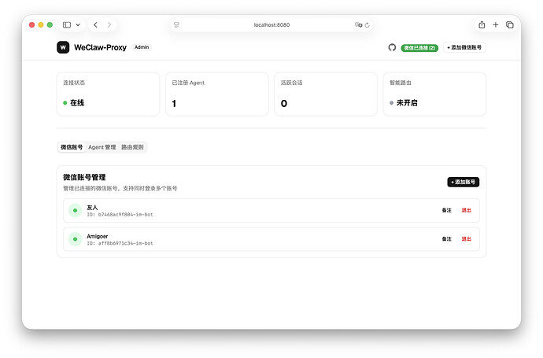
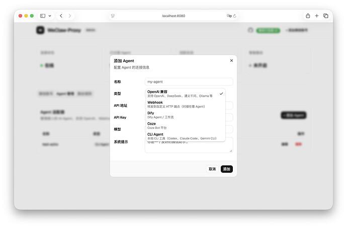
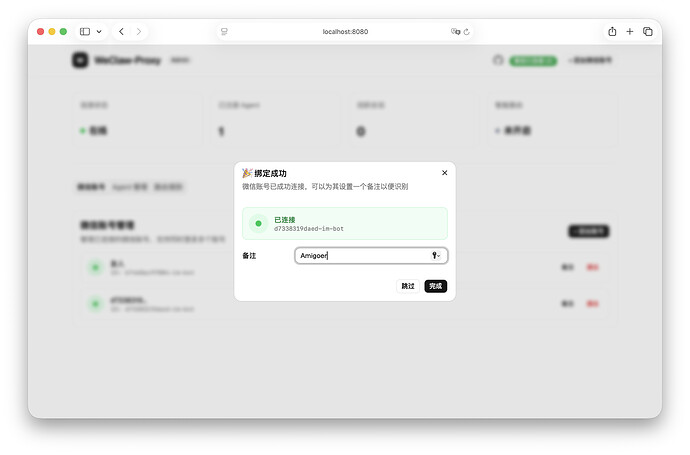
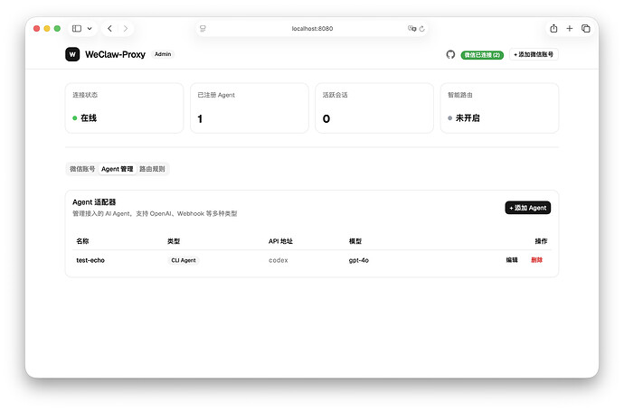
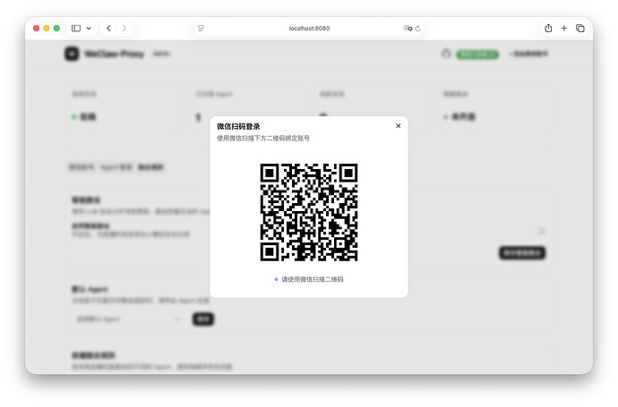
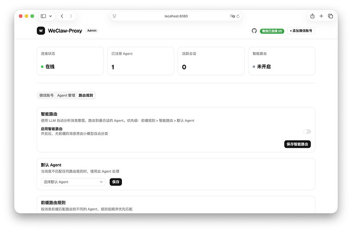

# 【开源】Weclaw-Proxy | 专为微信 OpenClaw 打造的极简 Agent 接入网关

- 作者：codermast
- 发布时间：2026-03-24T17:26:45.235Z
- 原帖链接：[https://linux.do/t/topic/1809561](https://linux.do/t/topic/1809561)
- 高保真页面：[查看 HTML 快照](./index.html)

---

#### 本帖使用社区开源推广，符合推广要求。我申明并遵循社区要求的以下内容：

-   **我的帖子已经打上 [开源推广](/tag/2234-tag/2234) 标签：** 是
-   **我的开源项目完整开源，无未开源部分：** 是
-   **我的开源项目已链接认可 LINUX DO 社区：** 是
-   **我帖子内的项目介绍，AI生成、润色内容部分已截图发出：** 是
-   **以上选择我承诺是永久有效的，接受社区和佬友监督：** 是

_以下为项目介绍正文内容，AI生成、润色内容已使用截图方式发出_

* * *

最近微信上线了 Claw 的接入端点，开放了底层的 iLink 协议，但是主要还是针对 OpenClaw ，我自己的需求是做了一些 Agent，想接入就比较麻烦，考虑到佬友可能也会有这个需求，就自己手写了一个基于 Go 的 WeClaw 的接入网关，尽管有一些类似的项目，但是大部分都是基于命令行，对于程序员可能来说使用没什么门槛，但是对零基础想接入扩展玩的佬友，没有可视化界面可以说是非常致命了，也是方便管理了，这里就加了可视化界面。

另外的话这里是实现了一个智能路由的功能，可以正常处理发送过来的消息，不用手动填写 /target 目标端点，更加优化体验。

Github：[https://github.com/amigoer/weclaw-proxy](https://github.com/amigoer/weclaw-proxy)

下面是一些演示截图:

[

screenshot-accounts2794×1844 214 KB

](https://cdn3.linux.do/original/4X/e/5/9/e59e0e857cb895caac8d45b470c2208893dbe8e3.jpeg "screenshot-accounts")

[

screenshot-addagent2794×1844 216 KB

](https://cdn3.linux.do/original/4X/8/c/b/8cb89640e5cfe449cf6270011c0ca1188391b933.jpeg "screenshot-addagent")

[

screenshot-bindingsuccess2794×1844 189 KB

](https://cdn3.linux.do/original/4X/7/7/a/77a1d11f4153992678c5dd65e065acff571eb279.jpeg "screenshot-bindingsuccess")

[

screenshot-dashboard2794×1844 206 KB

](https://cdn3.linux.do/original/4X/3/9/6/396fcf2f95ff1b44aaffb68a79f4300990a9e247.jpeg "screenshot-dashboard")

[

screenshot-login2794×1844 220 KB

](https://cdn3.linux.do/original/4X/4/8/8/48881ed6ceb0af722f12148bd185722eac8e4c59.jpeg "screenshot-login")

[

screenshot-routing2794×1844 249 KB

](https://cdn3.linux.do/original/4X/0/3/1/0317db44019ebd0a30c5b5c1dbdb530c38e6a32f.jpeg "screenshot-routing")

另外部署的话，支持 Windows、Linux、macOS 的 amd64、arm64 版本，也提供了初版的 docker 镜像，方便大家接入。

如果有帮助的话，希望大家能给点个 Star 支持一下，感谢各位佬友！ 

* * *

## 更新记录

-   v0.1.0 初版发布，支持可视化管理，智能路由
-   v0.1.1 新增 Codex Claude Gemini 等CLI接入
-   v0.2.0 支持多微信接入
