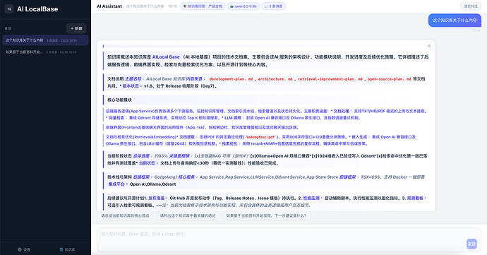
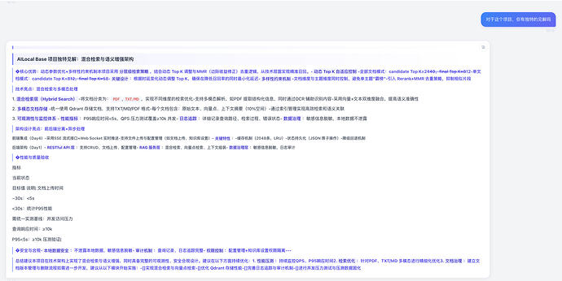

# 我的知识库开源啦～～～

- 作者：viliss
- 发布时间：2026-03-25T15:40:37.984Z
- 原帖链接：[https://linux.do/t/topic/1814969](https://linux.do/t/topic/1814969)
- 高保真页面：[查看 HTML 快照](./index.html)

---

我来晚啦，佬友们，本来昨天就想把docker环境测试跑通然后发布的。昨天下午午睡了3小时，想着通宵把最后的测试和文件整理。然后看到教育界某网红cs，吓的我将近一点就睡觉了，狗命要紧…

#### 本帖使用社区公益推广，符合推广要求。我申明并遵循社区要求的以下内容：

-   **我的项目是免费使用的，无收费（变相收费、赞助）部分：** 是
-   **我的帖子已经打上 [公益推广](/tag/1515-tag/1515) 标签：** 是
-   **我的项目属于个人项目，与公司或商业机构无关：** 是
-   **我的项目不存在QQ、TG等群组引流：** 是
-   **我的项目不存在非运营必要的网站引流：** 是
-   **我的项目不存在为他人推广、AFF：** 是
-   **我的项目无关联的商业项目：** 是
-   **我的站点存在登录，并已接入 LINUX DO Connect：** 否
-   **我帖子内的项目介绍，AI生成、润色内容部分已截图发出：** 是
-   **以上选择我承诺是永久有效的，接受社区和佬友监督：** 是

_以下为项目介绍正文内容，AI生成、润色内容已使用截图方式发出_

* * *

好了，接下来就是正题  
[ai-localbase（AI本地知识库）](https://github.com/veyliss/ai-localbase)

# AI LocalBase

一个本地优先的 AI 知识库系统（RAG），用于把本地文档接入向量检索与大模型对话流程。项目提供完整的 Web UI，支持知识库管理、文档上传、检索增强问答、聊天记录持久化，以及基于 Ollama 或 OpenAI 兼容接口的模型接入。

后端基于 Go + Gin，前端基于 React + Vite + TypeScript，向量数据库使用 Qdrant，适合个人或小团队在本地环境、自托管环境中快速搭建可用的知识库问答系统。

## 功能特性

### 核心能力

-   知识库管理：创建、删除知识库，查看文档列表
-   文档上传与索引：支持 TXT、Markdown、PDF 文件上传与解析
-   检索增强问答：基于 Qdrant 做向量检索并把命中内容注入对话上下文
-   聊天记录持久化：会话消息保存到本地 SQLite 数据库，重启后仍可恢复
-   配置持久化：模型配置与知识库状态保存到本地 JSON 文件
-   Docker Compose 部署：支持一键拉起前端、后端、Qdrant

### 模型接入能力

-   原生支持 Ollama 聊天与嵌入调用
-   支持 OpenAI 兼容 API 聊天模型接入
-   Chat 与 Embedding 可分别配置 Provider、Base URL、Model、API Key
-   模型调用失败时支持降级提示，避免前端直接报错

### 检索增强能力

-   文本自动切分与批量嵌入
-   候选结果动态召回
-   关键词覆盖增强重排
-   MMR 去冗余选择
-   低置信度场景二次扩召回
-   嵌入缓存与可选语义缓存
-   可选 Hybrid Search、Semantic Reranker、Query Rewrite、Context Compression

* * *

补图  

[

image1920×1007 323 KB

](https://cdn3.linux.do/original/4X/1/c/5/1c50ab2eebda89ca0e4726386e38fe83c38c57e2.jpeg "image")

  

[

image1920×965 267 KB

](https://cdn3.linux.do/original/4X/9/1/6/9160ef681a7700372f9ea891a54cb4f29c151800.jpeg "image")

\----分割线-----  
佬友们太给力了，不得不说，佬友们都很热情，鼓励、夸赞、还有建议，感谢各位佬友。  
我在这里再写一些内容吧，当作小彩蛋  
首先呢这算是一个小项目，大致两周就能够完成，能够这个项目中能够学习一些新知识，我分成三个阶段

1.  chat、页面结构、open ai、ollama接口类型。完成后可以可以进行简单对话
2.  搭上一个知识库系统，需要给模型加上提示词，前端的渲染，这样他就会根据知识库的内容回答，完成以后其实AI的回复还是很傻，因为他根本不能阅读文档内容
3.  增强检索功能，加上rag、嵌入模型，这样它的回复才会更加精准

然后说一下我踩过的小坑吧，前端的渲染目前还有一些问题，还有一些渲染友问题，佬友们看到不要喷我 
